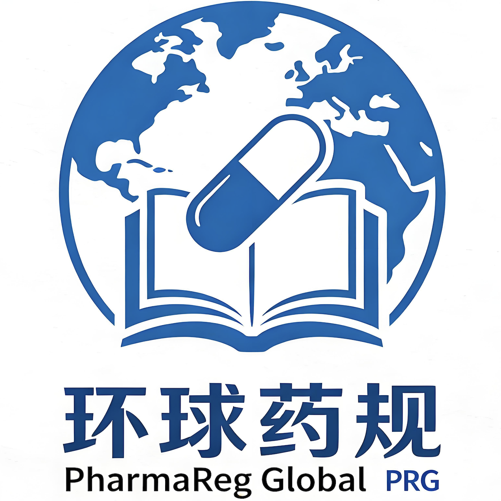
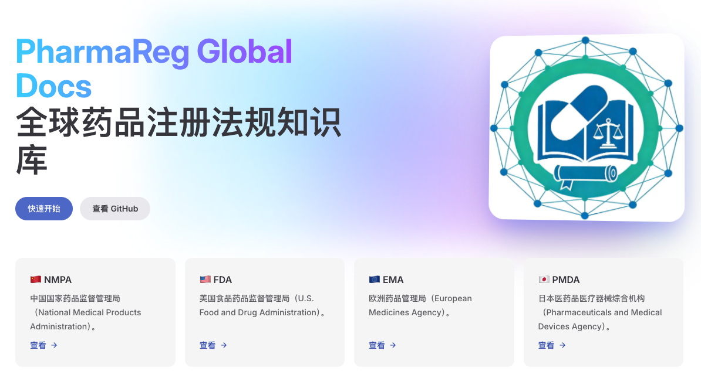

<h1 align="center">
  
  PharmaReg Global
</h1>

<p align="center">面向全球医药注册法规的开放知识库，汇集 NMPA/FDA/EMA/PMDA 等资料与实践要点，支持持续共建与快速检索，便于学习与落地。</p>

<p align="center">
  <a href="https://yimai-ai-doc.github.io/PharmaReg-Global/" target="_blank" rel="noopener noreferrer">
    🔗 官网访问地址：yimai-ai-doc.github.io/PharmaReg-Global/
  </a>
</p>

<p align="center">
  
</p>

## 功能概览

- 多语言：中文（/zh/）与英文（/en/）
- 首页栏目：NMPA / FDA / EMA / PMDA（已配置入口页，后续可持续扩展）
- 热门文档热搜榜：实时更新，近7天访问热度排行
- 项目站点部署：支持 GitHub Pages（base 已配置为仓库名路径）

## 项目结构

```text
PharmaReg-Global/
├─ .github/workflows/
│  └─ deploy.yml              # GitHub Pages 自动部署工作流
├─ docs/                      # VitePress 站点源文件
│  ├─ .vitepress/
│  │  ├─ config.mts           # 站点配置（多语言、导航、侧边栏、统计等）
│  │  └─ theme/               # 自定义主题（组件与样式）
│  ├─ public/                 # 公共静态资源（logo、hero 等）
│  ├─ zh/                     # 中文内容
│  │  ├─ index.md
│  │  ├─ guide/
│  │  ├─ nmpa/
│  │  ├─ fda/
│  │  ├─ ema/
│  │  └─ pmda/
│  ├─ en/                     # English content
│  │  ├─ index.md
│  │  ├─ guide/
│  │  ├─ nmpa/
│  │  ├─ fda/
│  │  ├─ ema/
│  │  └─ pmda/
│  └─ index.md                # 根首页（用于根路径渲染）
├─ package.json               # 项目脚本与依赖
├─ package-lock.json
└─ README.md
```

## License

本项目采用 CC BY 4.0（Creative Commons Attribution 4.0 International）许可协议，详见 [LICENSE](file:///Users/mzzhang/Documents/eCTD/Github静态网站部署/PharmaReg-Global/LICENSE)。
